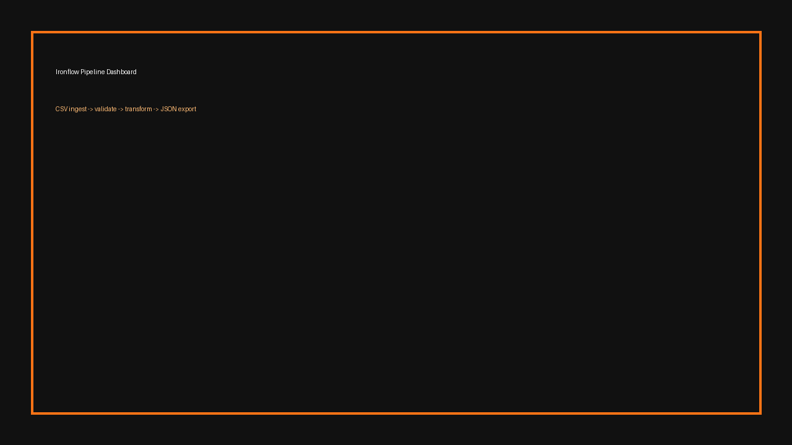

# Ironflow

[](https://github.com/dsantoreis/ironflow/actions/workflows/ci.yml) [](https://github.com/dsantoreis/ironflow/actions/workflows/docs.yml) [](#ci--coverage) [](./LICENSE)

## Hero

**Ironflow** is a production-focused Rust pipeline that converts raw operational CSV into deterministic JSON outputs for downstream systems.

Built for teams that need one binary that behaves the same in local runs, CI jobs, Docker containers, and Kubernetes workloads.




---

## Problem

Most ops pipelines fail under pressure because they depend on ad-hoc scripts, weak validation, and non-reproducible runtime behavior across environments.

Ironflow solves this with a strict CLI contract, deterministic transforms, and CI-gated quality.

---

## Quickstart (3 comandos, output determinístico local)

```bash
cargo build
cargo test --all
cargo run -- --input tests/fixtures/input.csv --output out.json --min-amount 10 --category retail --uppercase-name
```

---

## CLI

```bash
agent-data-pipeline-rust \
  --input <file.csv> \
  --output <file.json> \
  [--min-amount <f64>] \
  [--category <string>] \
  [--uppercase-name] \
  [--format json]
```

---

## Docs Site (Astro Starlight)

```bash
cd docs-site
npm install
npm run dev
```

Static build:

```bash
cd docs-site
npm run build
```

Published: https://dsantoreis.github.io/ironflow/ (GitHub Pages via `.github/workflows/docs.yml`)

---

## Docker

```bash
docker build -t ironflow:latest .
docker run --rm -v $(pwd)/tests/fixtures:/data ironflow:latest \
  --input /data/input.csv --output /data/out.json --min-amount 10 --uppercase-name
```

```bash
docker compose up --build
```

---

## Kubernetes

```bash
kubectl apply -f k8s/
```

---

## CI + Coverage

GitHub Actions executes:

- `cargo fmt --all -- --check`
- `cargo clippy --all-targets -- -D warnings`
- `cargo test --all`
- `cargo build --release`
- `cargo llvm-cov --all-targets --fail-under-lines 80 --summary-only`

Coverage is gated at **80% minimum** and uploaded as an artifact in CI.

---

## Architecture

- Core transform logic: `src/lib.rs`
- CLI and IO orchestration: `src/main.rs`
- Docs: `docs-site/` (Astro Starlight)
- Runtime manifests: `Dockerfile`, `k8s/pipeline-job.yaml`

---

## Results

Current test suite covers transformation behavior and CLI integration path (CSV → JSON), with coverage threshold enforced in CI.

---

## Roadmap

### 30 days
- Streaming mode (stdin/stdout)
- Better error taxonomy + operator-facing messages

### 90 days
- Pluggable transforms (WASM)
- Parquet export
- OpenTelemetry metrics + traces

---

## CTA

If Ironflow helps your team, star the repo and open an issue with your real pipeline use case.
Contributions with reproducible datasets and benchmark numbers are especially welcome.
