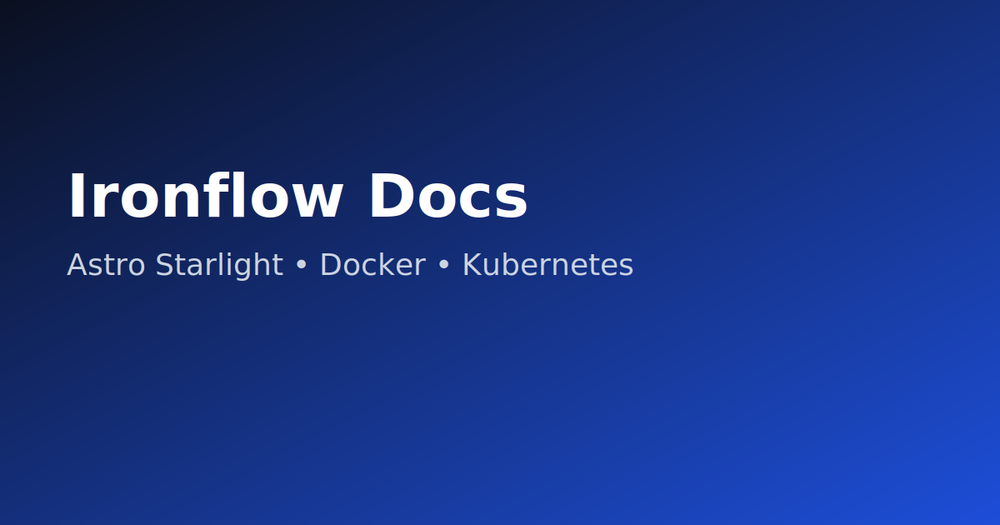

# Ironflow Docs — Conversão para Astro Starlight




Documentação migrada para **Astro + Starlight** para ter navegação rápida, build estático e deploy simples.

## Quickstart

```bash
npm ci
npm run dev
# http://localhost:4321
```

## Build

```bash
npm run build
npm run preview
```

## Docker

```bash
docker build -t ironflow-docs:latest .
docker run --rm -p 4321:4321 ironflow-docs:latest
```

## Kubernetes

```bash
kubectl apply -f k8s/
```

Ajuste o host no `k8s/ingress.yaml` para seu domínio real antes de produção.
